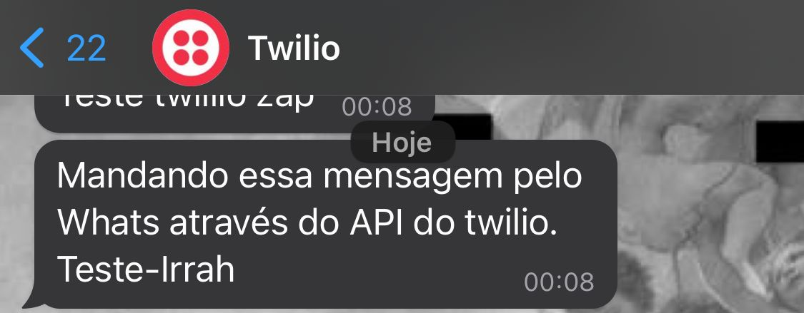

# Teste técnico Grupo Irrah

Java 20\
Spring-boot 3.1.2


## Docker
Utilizei o docker durante o desenvolvimento para hostear o banco de dados. Executei ele como descrito abaixo:

Rodar o seguinte comando para subir o container do PostgreSQL:
```
cd docker
docker-compose build
docker-compose up
cd ..
```

Infelizmente não consegui conectar o container do SpringBoot com o container do PostgreSQL.
Acredito que seja só alguma questão de configuração de host ou porta, pois o container do SpringBoot
não está conseguindo se conectar ao BD na hora de rodar o projeto.

Mesmo assim vou deixar a imagem do projeto aqui através do [DockerHub](https://hub.docker.com/repository/docker/narcizo/teste_irrah_backend_img/general).

Para criar um container dessa imagem, rodar o seguinte comando após baixar a imagem:
```
docker run -d -p 8081:8081 --name=teste_irrah_narcizo_con teste_irrah_backend_img
```

## Banco de Dados
Na pasta /pgdump tem um arquivo .sql que pode ser rodado para obter um 
backup do banco de dados que usei. Use o seguinte comando:
```
docker exec docker-db-1 psql -U admin teste_irrah_db < /pgdump/backup.sql
```

## IDE
Caso vá rodar numa IDE, eu usei o IntelliJ Community Edition e essas foram minhas configurações para 
rodar: 


## Swagger Doc
Quando rodar o projeto colocar a seguinte URL no navegador
http://localhost:8081/swagger-ui/index.html#/.

## Postman
Um arquivo JSON da collection do Postman que fiz para esse projeto está disponível na raiz do projeto com o nome 
```Teste Irrah.postman_collection.json```.

## FrontEnd
Infelizmente não consegui implementar um Frontend para esse projeto no tempo 
especificado, porém se quiser avaliar as minhas habilidades no frontend tenho um projeto exclusivamente frontend nesse 
[repo aqui](https://github.com/narcizo/Teste-Be220) utilizando Ionic e Angular.

## Envio de SMS e Whatsapp
Para o envio das mensagens usei a api da [Twilio](https://mvnrepository.com/artifact/com.twilio.sdk/twilio/9.9.1),
tanto para SMS quanto para WhatsApp.

Infelizmente por questões de segurança essa feature não estará disponível, pois precisaria 
compartilhar informações sensíveis sobre a minha conta na Twilio, portanto irei disponibilizar alguns prints da feature
funcionando./

### Mandando mensagem por SMS via API do Twilio

### Mandando mensagem por WhatsApp via API do Twilio


## Dúvidas e contato
Quaisquer dúvidas sobre o projeto por favor me mandar mensagem no [LinkedIn](https://www.linkedin.com/in/narcizog/)
ou pelo meu email narcizo.gabriel2@gmail.com.
